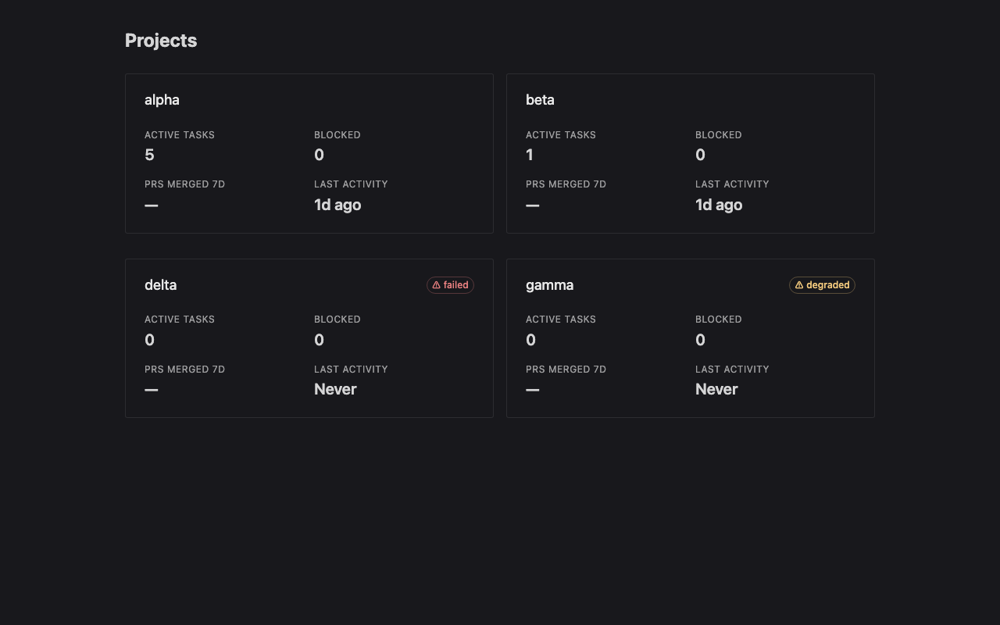
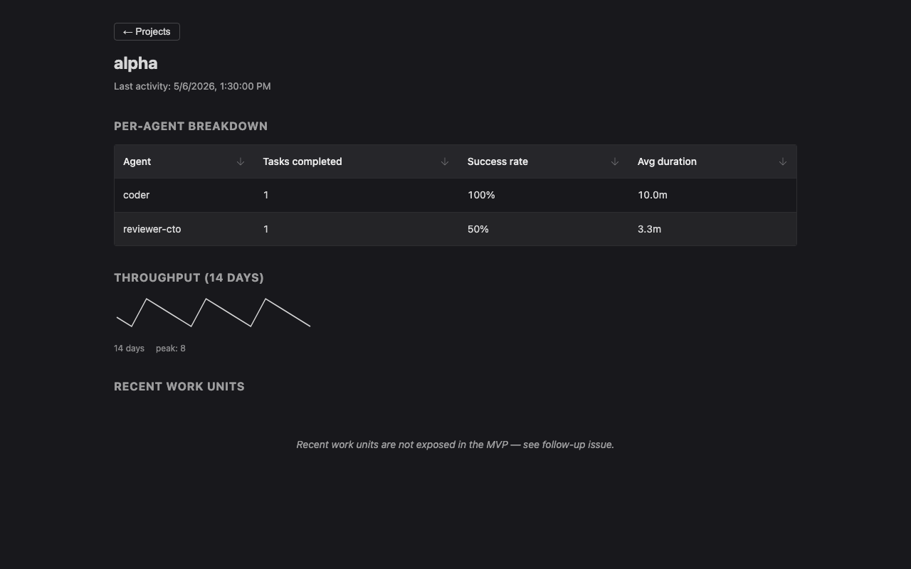
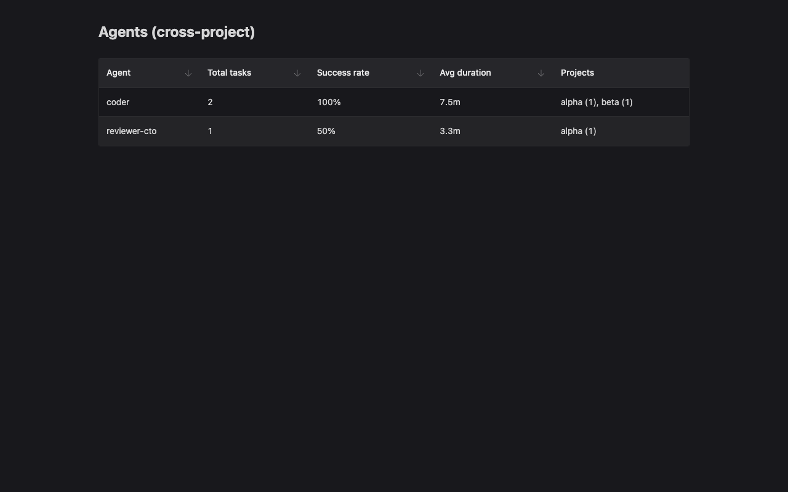

# metaswarm-dashboard

## Overview

Read-only multi-project dashboard for metaswarm-managed projects (Vue 3 + naive-ui + Fastify + npm workspaces).

A single-operator local tool that gives one human visibility across N metaswarm-managed projects without `cd`-ing between them. Reads `.beads/` data from each configured project and serves a small SPA with three views.

This is **Step 1 of a 3-step arc** ([issue #1](https://github.com/montoyaedu/metaswarm-dashboard/issues/1)). Step 2 (evals scoring) and Step 3 (observability) are explicit non-goals here.

## Screenshots

| | |
|:-:|:-:|
|  |  |
| Projects index | Project detail (with sortable agent table + 14-day throughput sparkline) |
|  | |
| Agents (cross-project aggregate) | |

## Architecture

```
host project A/.beads/  ─┐  (read-only, byte-identical before/after)
host project B/.beads/  ─┼── metaswarm-dashboard collect ──> central data dir
host project C/.beads/  ─┘                                          │
                                                                    ▼
                                            metaswarm-dashboard serve (Fastify, port 5174)
                                                                    │
                                                                    ▼
                                                    Vue 3 + naive-ui SPA (browser)
```

**Zero footprint** in host repos is the load-bearing invariant. The collector reads `.beads/`-tracked JSONL plus `bd list --json`, then writes per-project snapshots into a central XDG-aware data dir under your home. Host project files are never modified — verified by an automated test that recursive-sha256-diffs fixture host repos before/after a `collect --all` run.

## Prerequisites

- **Node 22.12.0+** (pinned via `.nvmrc`; required by Vite 8 / Vitest 4). The repo uses `.nvmrc` which is read by every major version manager: `nvm use`, `fnm use`, `volta install node@22.12.0`, or `sudo n auto` all work. Pick whichever you have.
- **`bd` CLI** (the [BEADS](https://github.com/steveyegge/beads) issue tracker that metaswarm uses). The collector runs `bd list --json` against each configured project. Install per the upstream BEADS docs.
- **Dolt SQL server** for BEADS `--server` mode (only required if your `bd` binary was compiled without CGO — common on macOS Apple Silicon). Run `brew install dolt` (or equivalent), then `dolt sql-server -H 127.0.0.1 -P 3307` in a background terminal/launchd entry. `bd init --server` then connects to it. See the [BEADS server-mode docs](https://github.com/steveyegge/beads) for details.
- **Optional**: a real GitHub authentication via `gh auth login` is *not* required by the MVP — `prsMergedLast7d` is hard-coded `null` in this release (see [Why is PRs-merged showing —?](#why-is-prs-merged-showing-)).

## Install

```bash
git clone git@github.com:montoyaedu/metaswarm-dashboard.git
cd metaswarm-dashboard
nvm use            # picks up .nvmrc (22.12.0). Or: `n auto`, `fnm use`, `volta install node@22.12.0`
npm ci             # installs all four workspace packages
npm run build      # builds packages/types, collector, server, web
```

`npm run build` emits compiled JS under each workspace's `dist/`. The `bin/metaswarm-dashboard` ESM dispatcher imports those compiled subpaths.

## Discovering existing `.beads/`-tracked projects

The MVP doesn't auto-discover projects (`config.yaml` is explicit by design — see [STACK.md](STACK.md) for the rationale). To find candidates under a parent dir, use the bundled helper:

```bash
./bin/discover-projects.sh ~/code ~/ethiclab
# Prints YAML you can paste into ~/.config/metaswarm-dashboard/config.yaml
```

A future `metaswarm-dashboard config discover` subcommand will integrate this — see [issue #5](https://github.com/montoyaedu/metaswarm-dashboard/issues/5).

## Quick start

The fastest path is the bundled starter:

```bash
# Verifies node, builds if needed, initializes config.yaml on first run,
# then collect --all, then serve. Idempotent — safe to re-run anytime.
./start.sh

# First-time setup tip: scan one or more parent dirs for .beads/-tracked
# projects and review-then-append them to config.yaml interactively:
./start.sh --discover ~/code ~/work

# See `./start.sh --help` for --reinit / --no-collect / --no-serve / --port flags.
```

If you prefer the manual path (or want to script the steps individually):

```bash
# 1. Write a starter config.yaml at the XDG-aware location.
metaswarm-dashboard config init
# → ~/.config/metaswarm-dashboard/config.yaml on linux
# → ~/Library/Application Support/metaswarm-dashboard/config.yaml on macOS

# 2. Edit config.yaml: list every project you want collected.
# projects:
#   - name: foo
#     path: ~/code/foo
#   - name: bar
#     path: ~/work/bar

# 3. Collect snapshots from every project.
metaswarm-dashboard collect --all
# → writes <data-dir>/projects/<name>/daily/YYYY-MM-DD.json (UTC)
# → on Monday-UTC runs also writes <data-dir>/projects/<name>/weekly/YYYY-Www.json

# 4. Serve the SPA + read-only API on port 5174.
metaswarm-dashboard serve
# → open http://127.0.0.1:5174
```

## Subcommands

### `metaswarm-dashboard config init`

Writes a starter `config.yaml` at the XDG-aware location. Refuses to overwrite an existing file unless you pass `--force`.

| Flag | Description |
|---|---|
| `--force` | Overwrite an existing `config.yaml` |

### `metaswarm-dashboard collect`

Reads each configured project's `.beads/` directory + `bd list --json` output, computes per-agent and project-wide metrics, and writes one snapshot per UTC day. Idempotent: re-running on the same UTC day overwrites the day's file. Monday-UTC runs additionally write a weekly file for the prior ISO week. Non-Monday runs do **not** backfill missing weekly files.

| Flag | Description |
|---|---|
| `--project <name>` | Collect a single project from `config.yaml` |
| `--all` | Collect every project listed in `config.yaml` |

Skips projects whose path is missing or whose `.beads/` is absent (with a clear log line). Malformed JSONL rows are skipped with a warning, never crash.

### `metaswarm-dashboard serve`

Starts the local Fastify server. Refuses non-GET methods on `/api/*` with HTTP 405 (the dashboard is structurally read-only). Falls back to `index.html` for any non-`/api` GET so the SPA's history-mode router works on direct navigation.

| Flag | Description |
|---|---|
| `--port <port>` | Port to listen on (default 5174) |

| Env var | Description |
|---|---|
| `METASWARM_DASHBOARD_DATA_DIR` | Override the snapshots data dir |
| `METASWARM_DASHBOARD_CONFIG` | Override the config.yaml path |
| `METASWARM_DASHBOARD_TRANSCRIPTS_DIR` | Override the Claude Code transcripts dir (default `~/.claude/projects`) — see [Observing Claude Code sessions](#observing-claude-code-sessions) |

## Observing Claude Code sessions

Beyond the BEADS-derived project metrics, the dashboard also reads the
**Claude Code session transcripts** your agents leave behind under
`~/.claude/projects/` and surfaces them as a session logbook you can review
and rate. This is the dashboard's read of *how a session actually went*.

### What it does

For each closed Claude Code session the dashboard:

- **Discovers** the transcript JSONL for every configured project (matching
  each project's path to its `~/.claude/projects/<encoded-cwd>/` directory).
- **Scores** the session against a 9-KPI rubric (setup discipline, planning,
  TDD, error handling, thrashing, cross-reference, communication, prompt
  coherence, workflow touchpoints). **The rubric is an advisory suggestion,
  not a grade** — it is a heuristic first guess, nothing more.
- **Lets you rate** the session yourself, per KPI (`pass` / `watch` / `fail`
  / `na` / `unsure`). Your rating is the ground truth; partial ratings (rate
  3 of 9 KPIs) and rare use are fully supported — rate only the sessions you
  care about.
- **Accrues calibration**: as you rate sessions, the dashboard tallies how
  often the rubric's suggestion agreed with your own verdict, per KPI. A
  criterion that systematically disagrees can be retired; one that agrees can
  be trusted more.

### The `/sessions` dashboard view

Open the dashboard and navigate to **Sessions** from the nav bar:

- **List** — every discovered session across all configured projects: which
  project, when it ran, how long, how many events, and whether you have
  rated it yet.
- **Detail + timeline** — open any session for its event timeline (prompts,
  tool calls, results) without re-reading raw JSONL.
- **Rating survey** — record your per-KPI verdict for the session. Re-opening
  a rated session pre-populates your previous answers; saving again upserts.
- **Calibration summary** — a panel on `/sessions` showing per-KPI rubric-vs-
  operator agreement, with a sample-size floor (`N ≥ 5`) so small-N noise is
  not mistaken for signal.

### AI cost

The dashboard also computes the **AI cost** of each session and project from
the transcripts and delegation-tool logs your agents leave behind. Cost is
**computed on read** — nothing is persisted, no new datalake file is created.

- **How it is computed.** Each Claude Code `assistant` record carries a
  `message.usage` token tally (input / output / cache-read / cache-write,
  including the `ephemeral_1h` / `ephemeral_5m` cache-write split) and a
  `message.model`. The dashboard multiplies those token counts by a **pinned,
  in-repo price table** (`packages/sessions/src/cost/model-prices.json`). A
  session's cost is the sum over its `assistant` records — the main transcript
  **and** every sibling `subagents/agent-*.jsonl` subagent file. Codex runs are
  read from `~/.codex/sessions/`, Gemini runs from metaswarm's
  `external-tools.jsonl` ledger.
- **The pinned price table.** Prices are **version-controlled, not fetched** —
  no network calls, no live pricing. The table carries a `pricingAsOf` date;
  the dashboard surfaces it as a small *"AI prices as of YYYY-MM-DD"* footnote
  on every cost view so a stale table is visible at a glance. **Verify the
  rates against the vendors' current public pricing** before relying on the
  figures — see `model-prices.source.md` for the cited sources.
- **Unknown / unpriced models.** A model id absent from the price table is
  **never costed as `$0`** — that would be indistinguishable from a genuinely
  free run. It renders `"n/a"`, and any total it contributes to is shown as a
  lower bound: `"$X + unpriced"`.
- **Per-vendor breakdown.** The project detail view shows a per-vendor cost
  row for **all three** vendors (Anthropic / OpenAI / Google) — a vendor with
  no runs still shows `"$0.00 (0 runs)"`, so you can see it was considered.
  Gemini ledger records carry no working directory, so Gemini cost is reported
  in an `unattributed` row on the projects index rather than against a
  specific project.

### Security note — prompt text may contain secrets

The session survey panel surfaces **full user-prompt text** and the session's
AI-generated title (`aiTitle`). Like the tool-use `summary` strings, these
**may contain operator secrets** (a prompt can paste an API key, a token, a
password). This is **accepted, not an oversight**: the dashboard is
localhost-only — no CORS, no telemetry, no outbound fetch — so the content
never leaves your machine. The in-repo secret-scan that guards committed
fixtures does **not** cover prompt text (prompts are not in-repo). If you
share screenshots or screen-share the `/sessions` view, treat prompt text as
potentially sensitive. See `docs/follow-ups/sessions.md` for the full
acceptance record.

### Where transcripts and ratings live

The dashboard reads transcripts from `~/.claude/projects/` by default.
Override the location with the `METASWARM_DASHBOARD_TRANSCRIPTS_DIR` env var
(set the same value for `serve` as wherever Claude Code writes its
transcripts). The Codex sessions tree and the metaswarm external-tools ledger
default to `~/.codex/sessions/` and `~/.claude/sessions/external-tools.jsonl`;
override them with `METASWARM_DASHBOARD_CODEX_SESSIONS_DIR` and
`METASWARM_DASHBOARD_EXTERNAL_TOOLS_LEDGER`.

Your ratings are written **only to the dashboard's own data dir** (the same
XDG-aware datalake `collect` uses) — one `<sessionId>.rating.json` per rated
session. Transcripts under `~/.claude/projects/`, `~/.codex/sessions/`, the
external-tools ledger, and your observed repos are **never modified**: the
zero-footprint invariant holds for the Sessions feature exactly as it does
for `collect`. AI cost is computed in memory and never written to disk.

## Troubleshooting

### Why is PRs-merged showing "—"?

The MVP intentionally leaves `prsMergedLast7d: null` — so the SPA renders "—" everywhere this metric is shown. This is a deliberate scope reduction (the issue lists the metric, but specifying a data source would have pulled in either external GitHub fetches or extending BEADS itself, both out of scope for Step 1). A follow-up issue tracks picking a source: [issue #2](https://github.com/montoyaedu/metaswarm-dashboard/issues/2).

### `bd: command not found`

The collector shells out to `bd list --json` per project. Install the BEADS CLI per the upstream docs (`https://github.com/steveyegge/beads`) and ensure `bd` is on PATH. The collector surfaces a clear error referencing this section when ENOENT is hit.

### `metaswarm-dashboard serve: config file not found`

Run `metaswarm-dashboard config init` to write a starter `config.yaml`, then edit it to list your projects.

### Port 5174 already in use

Pass `--port <other>`: `metaswarm-dashboard serve --port 8080`.

### `EBADENGINE` warnings during `npm ci`

Your node version is below `22.12.0`. Run `nvm use` (the repo pins `.nvmrc 22.12.0`) and re-run `npm ci`.

### Snapshots aren't appearing in the SPA

`metaswarm-dashboard serve` reads from the data dir (default `~/Library/Application Support/metaswarm-dashboard/` on macOS or `~/.local/share/metaswarm-dashboard/` on linux). If you set `METASWARM_DASHBOARD_DATA_DIR` for `collect`, set the same env var when running `serve`.

## Coverage + CI

The project enforces 100% line/branch/function/statement coverage at the workspace root via `vitest` v8 coverage with thresholds wired from `.coverage-thresholds.json` (ESM JSON import). The threshold gate runs only at `npm run test:coverage` from the root — per-package `npm run test --workspace X` invocations skip the gate so intermediate WUs aren't blocked by other-package incompleteness.

CI (`.github/workflows/ci.yml`) runs `lint / typecheck / test:coverage / build` on a `[ubuntu-latest, macos-latest]` matrix with node 22.12.0, plus a `node ./bin/metaswarm-dashboard --help` smoke and `shellcheck bin/*.sh` (ubuntu-only).

## Roadmap

- **Step 2 — Evals scoring** of hot-path agents using metaswarm's existing `rubrics/`. Out of scope here.
- **Step 3 — Observability** (per-agent I/O capture, latency, cost). Out of scope here.
- The longer-term ambition (band.ai-style real-time multi-peer governance) is **explicitly out of scope** for this repo, but the architecture should not preclude it.

## Repository layout

```
metaswarm-dashboard/
├── package.json                 # npm workspaces root
├── packages/
│   ├── types/                   # shared TS types + Zod schemas (one source of truth)
│   ├── collector/               # CLI + readers + metrics + atomic writer
│   ├── server/                  # Fastify server + snapshot reader + aggregator
│   └── web/                     # Vue 3 + naive-ui + vue-router 4 SPA
├── bin/metaswarm-dashboard      # thin ESM shebang dispatcher
├── docs/                        # screenshots + sample snapshot + walkthrough log
├── scripts/take-screenshots.mjs # Playwright capture harness
├── .beads/                      # metaswarm orchestration state (committed)
├── CLAUDE.md                    # metaswarm project instructions
└── .coverage-thresholds.json    # 100% coverage gate
```

## License

To be added.
